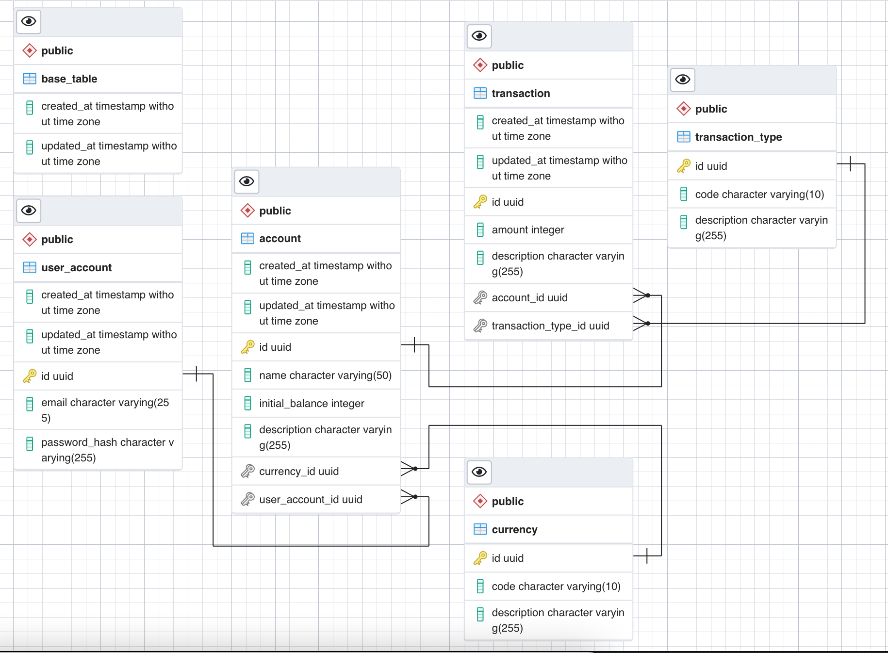

# golang-resful-api
Very simple RESTful API and JWT authentication with Golang

## Technical and tools in use
- Golang: `go version go1.16.6 darwin/amd64`
- PostgreSQL: `psql (PostgreSQL) 13.3`
- [JWT](https://jwt.io/)
- [Visual Studio Code](https://code.visualstudio.com/)

## Database
### ERD


### Schema
- File: `database/schema.sql`
- Run schema: `psql DB_NAME < database/schema.sql`

## API Resource

### Auth user resource

```
POST   /api/v1/user/create
POST   /api/v1/user/login
```

### Account resource 
```
GET    /api/v1/account/
GET    /api/v1/account/by_current_user
POST   /api/v1/account/
PUT    /api/v1/account/
```

### Transaction resource 
```
GET    /api/v1/transaction/
POST   /api/v1/transaction/
GET    /api/v1/transaction/:id
PUT    /api/v1/transaction/
DELETE /api/v1/transaction/:id
GET    /api/v1/transaction/search
```

## Import collection to Postman for testing API
- File: `documentation/GoTestAPI.postman_collection.json`

## API Design
- File: `documentation/api-design.yaml`
- Type: `OpenAPI 3.0`
- Format: `YAML`

## Go run

```
sh dev.sh
```

## Reference
- https://pkg.go.dev/github.com/jackc/pgx#section-documentation
- https://golang.org/

